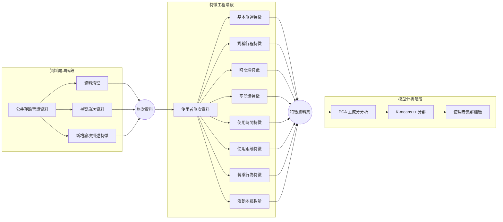

# 方法論

## 方法論架構

## 資料處理階段

公共運輸電子票證研究中，由於不同單位所紀錄之票卡資訊各有不同，且在電子票證分析中，並無法將原始資料直接輸入模型進行分析，因此需要先對原始資料集進行清理，整理成可以輸入模型分析之變數，本研究取得高雄市MaaS系統 - MeNGo 於2023年11月之使用者電子票證資料，如表....(表格放下面)，

### 原始資料處理

本研究使用高屏澎運輸研究發展中心所提供之高雄市 MaaS 系統 - MeNGo 於 2023年11月，為期一個月之使用者電子票證資料進行實證研究，共計1,603,411筆資料，45,115個使用者，以下章節詳述本研究資料處理流程。

%% 應該要去做一個表格吧，就是去寫每個資料欄位代表的意義%%

%% 資料簡介 %%

MeNGo使用者使用運具比例
![[Pasted image 20250618123413.png]]
#### 使用者資料清理

%% 要記得去說明資料限制 %%
%% 還有要去畫出資料處理的流程圖 %%

為了解MaaS使用者(通勤者)之公共運輸使用特性，本研究以高雄市MaaS系統進行實證研究，資料集中運輸業者(運輸系統)包括：高雄捷運、高雄輕軌、公車業者、共享自行車、公車小黃業者...等在MeNGo服務中有包含的運輸業者，本研究主要關心公共運輸系統之使用者，於公車旅次之刷卡資料無法辨識使用者上下車的確切站點位置，僅能以是否有轉乘行為進行區分，因此本研究以捷運刷卡資料為基礎，公車及其他運具於資料期間之使用率為輔，對高雄市MaaS系統使用者之旅行行為進行分析。

#### 捷運上車時間推估

首先說明捷運票證資料，在初步資料處理階段，發現該資料集在欄位上有缺漏及紀錄資訊不完整的情形，缺漏在MeNGo票證資料上，捷運刷卡資料僅記錄該使用者當次刷卡出站時間，其資料狀態紀錄為"定期票下車"(這裡應該可以補圖去說明他是怎樣缺漏的。)，因此為取得捷運使用者之上車時間，本研究透過TDX平台上所取得之''高雄捷運站間行駛時間''，作為推估捷運使用者上車時間之基礎，用以補足捷運使用者在資料欄位中所缺少的上車時間資料。

具體流程....

#### 使用者特徵描述欄位

在完成資料補足的部分後，為在後 續分析的方便進行，本研究於資料欄位中新增數個資料欄位，包括：旅程時間、星期幾上車、上車時間(小時)，此類使用者票證資料的旅行行為模式描述，作為後續特徵工程之對象，以萃取出更細緻之使用者旅行行為特徵。

### 特徵資料集

透過八大類使用者行為去描述使用者在公共運輸使用上的特性，主要目的是去找出每個使用者的旅次特性，
#### 基本旅運統計行為特徵
1. 總使用天數：travel_days
2. 總使用次數：total_trips
3. 平均每日使用次數：avg_trips_per_day

#### 對稱行程特徵
1. 對稱行程天數：symmetrical_days
2. 對稱行程比例：symmetry_ratio

#### 使用時間特徵
1. 平均旅行時間：avg_travel_time
2. 旅行時間標準差：std_travel_time
3. 工作日旅次比率：weekday_trip_ratio
4. 假日旅次比率：weekend_trip_ratio
5. 尖峰時間使用比率：peak_hour_ratio

#### 距離特徵
1. 總搭乘距離：total_distance
2. 平均搭乘距離：avg_distance
3. 最大搭乘距離：max_distance
4. 最小搭乘距離：min_distance
5. 搭乘距離標準差：std_distance

#### 時間熵特徵
- 首趟行程的上車時間熵：first_boarding_entropy
	- $E_{\text{time, first}} = \frac{ -\sum_{i=0}^{23} P_{\text{first}, i} \log_2(P_{\text{first}, i}) }{ \log_2(24) }$
- 末趟行程的上車時間熵：last_boarding_entropy
	- $E_{\text{time, last}} = \frac{ -\sum_{i=0}^{23} P_{\text{last}, i} \log_2(P_{\text{last}, i}) }{ \log_2(24) }$
- 平均的上車時間熵：avg_boarding_entropy
	- $E_{\text{time, avg}} = \frac{1}{2} \left( E_{\text{time, first}} + E_{\text{time, last}} \right)$
		- $P_{first,i​}$：每天首趟出發時間落在第 $i$ 個小時（0到23）的機率。例如，若某人每天早上6點出發的機率是0.8，則 $P_{first,6}=0.8$。
		- $P_{last,i​}$：每天末趟出發時間落在第 $i$ 個小時（0到23）的機率。例如，若某人每天晚上10點出發的機率是0.7，則 $P_{last,22}=0.7$。
		- $log_2​(24)$：正規化因子，用來將熵的值標準化到0到1的範圍內，因為一天有24個小時，$log_2​(24)$ 是最大的可能熵值。

#### 空間熵特徵
- 首趟行程的上車地點熵：first_boarding_place_entropy
- 首趟行程的下車地點熵：first_alighting_place_entropy
- 末趟行程的上車地點熵：last_boarding_place_entropy
- 末趟行程的下車地點熵：last_alighting_place_entropy

$$E_{\text{place}} = 
\begin{cases} 
0 & \text{if } n_{\text{unique}} \leq 1 \\ 
\frac{ -\sum_{a=1}^{n_{\text{unique}}} P_a \log_2(P_a) }{ \log_2(n_{\text{unique}}) } & \text{if } n_{\text{unique}} > 1 
\end{cases}$$

#### 轉乘特徵
1. 總轉乘次數：total_transfer
2. 公車轉捷運次數：bus_to_mrt
3. 捷運轉公車次數：mrt_to_bus
4. 工作日轉乘次數：weekday_transfer
5. 假日轉乘次數：weekend_transfer
6. 平均轉乘次數：avg_transfer

#### 活動站點特徵
1. 一天中第一次行程的上車地點個數：unique_first_boarding_place
2.  一天中第一次行程的下車地點個數：unique_first_alighting_place
3.  一天中最後一次行程的上車地點個數：unique_last_boarding_place
4. 一天中最後一次行程的下車地點個數：unique_last_alighting_place

## 主成分分析(Principal Component Analysis, PCA)

主成分分析(Principal Component Analysis, PCA)，是為一種線性降維方法，主要目的在透過特徵值及特徵向量分解，將所有特徵分解成數個不相關的主成分方向，以達成降低資料維度的目的，

==- [ ] 要去說明為啥不用FA要用PCA==
## K-means++

## 多項羅吉特模式 (Multinominal Logit Model, MNL)

